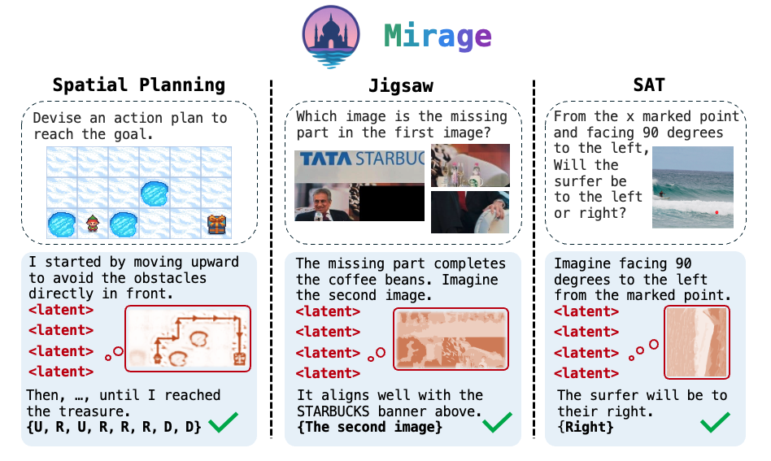
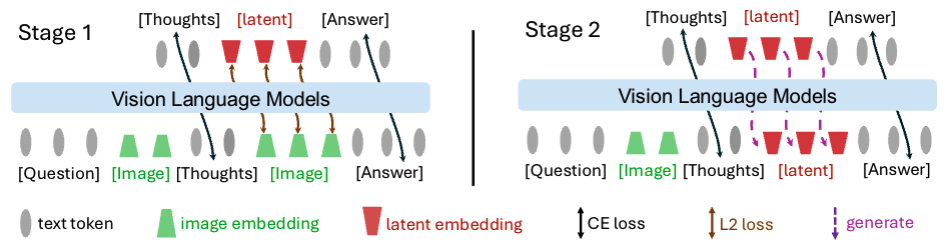

<p align="center">
  <h1 align="center">Machine Mental Imagery: Empower Multimodal Reasoning with Latent Visual Tokens</h1>
  <p align="center">
    arXiv 2025
  </p>
  <p align="center">
    <a href="https://miicheyang.github.io">Zeyuan Yang*</a>,
    <a href="https://scholar.google.com/citations?user=AIm87GIAAAAJ">Xueyang Yu*</a>,
    <a href="https://chendl02.github.io/">Delin Chen</a>,
    <a href="https://maohaos2.github.io/Maohao/">Maohao Shen</a>,
    <a href="https://people.csail.mit.edu/ganchuang">Chuang Gan</a>
  </p>
  <p align="center">
    <a href="https://www.arxiv.org/abs/2506.17218">
      
    </a>
    <a href='https://vlm-mirage.github.io' style='padding-left: 0.5rem;'>
      
    </a>
  </p>
</p>


We propose **Mirage**, **interleaving latent visual tokens**, which represent compact imagery visual features, with explicit text tokens to solve diverse **multimodal reasoning** tasks, boosting the reasoning performance without the full pixel-level image generation.

<p align="center">
    
</p>

<br>

<!-- TABLE OF CONTENTS -->
<details open="open" style='padding: 10px; border-radius:5px 30px 30px 5px; border-style: solid; border-width: 1px;'>
  <summary>Tabel of Contents</summary>
  <ol>
    <li>
      <a href="#installation">Installation</a>
    </li>
    <li>
      <a href="#data-preparation">Data Preparation</a>
    </li>
    <li>
      <a href="#training">Training</a>
    </li>
    <!-- <li>
      <a href="#inference">Inference</a>
    </li> -->
    <li>
      <a href="#citation">Citation</a>
    </li>
    <li>
      <a href="#acknowledgement">Acknowledgement</a>
    </li>
  </ol>
</details>

## News
- [2025-06-19] We have released the training and inference code!

## Installation
Create a conda environment and install the required packages:
```bash
conda create -n mirage python=3.10
conda activate mirage

git clone https://github.com/UMass-Embodied-AGI/Mirage.git
cd Mirage
pip install -r requirements.txt
pip install -e ./transformers/.
```

## Data Preparation
We provide a sample dataset of 100 examples for the VSP spatial reasoning task. Please format your data file as follows:

```json
{
    "text_input": "Question",
    "text_output": "Answer",
    "image_input": ["input1.jpg"],
    "image_output": "helper_image.jpg"
}
```

## Training
We train our model in two stages:
- Stage 1 jointly supervises text and latent visual tokens, grounding the latter in the visual subspace.
- Stage 2 drops the latent supervision, anchoring the grounded latent tokens for subsequent text generation.

<p align="center">
    
</p>

Run the following commands to reproduce the training. Make sure to configure the `data_path` and `model_path` as needed.

**Training Stage 1**
```bash
python src/main.py \
    --model Qwen/Qwen2.5-VL-7B-Instruct --epochs 10 \
    --task vsp-spatial-reasoning \
    --latent_size 4 \
    --stage stage1 \
    --data_path ./data/sample.jsonl \
    --log_file ./log.txt \
    --save_model_path ./checkpoints/model_stage1 
```

**Training Stage 2**
```bash
python src/main.py \
    --model Qwen/Qwen2.5-VL-7B-Instruct --epochs 10 \
    --task vsp-spatial-reasoning \
    --latent_size 4 \
    --stage stage2 \
    --data_path ./data/sample.jsonl \
    --log_file ./log.txt \
    --load_model_path ./checkpoints/model_stage1
    --save_model_path ./checkpoints/model_stage2 
```

<!-- ## Inference -->


## Citation
If you find our work useful, please consider citing: 

```bibtex
@article{yang2025machine,
  title={Machine Mental Imagery: Empower Multimodal Reasoning with Latent Visual Tokens}, 
  author={Zeyuan Yang and Xueyang Yu and Delin Chen and Maohao Shen and Chuang Gan},
  year={2025},
  eprint={2506.17218},
  archivePrefix={arXiv},
  primaryClass={cs.CV},
  url={https://arxiv.org/abs/2506.17218}, 
}
```

## Acknowledgement
We would like to thank the following works for their code and models:
- Training: [Coconut](https://arxiv.org/abs/2412.06769), [Qwen](https://huggingface.co/Qwen) and [MVoT](https://arxiv.org/pdf/2501.07542)
- Datasets: [VSP](https://arxiv.org/abs/2407.01863), [Blink](https://zeyofu.github.io/blink/), [COMT](https://arxiv.org/abs/2412.12932) and [SAT](https://arxiv.org/abs/2412.07755)

We are extremely grateful to Haoyu Zhen, Bairu Hou, Guangtao Zeng, Yuncong Yang,
Jiaben Chen, Ziwei Liu, Zonghan Yang, Sunli Chen, Lixing Fang, and many other friends in our [Embodied AGI Lab](https://embodied-agi.cs.umass.edu/)
for their helpful feedback and insightful discussions.
